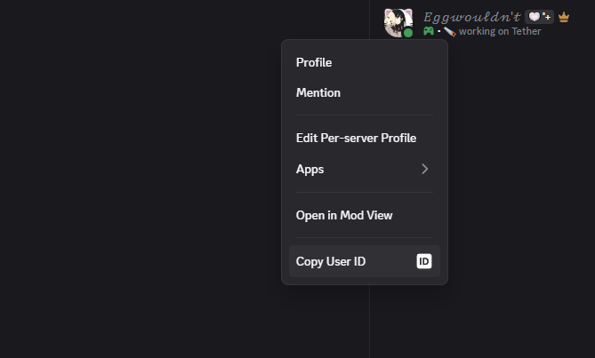
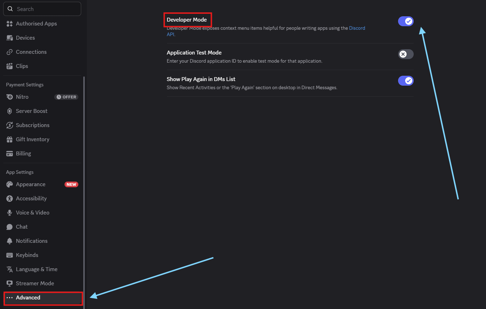

---
import { Zap, Blocks, Pyramid, Ban, Users, AudioWaveform, Rabbit, ServerCog, PackageOpen } from "lucide-react"
import ApiPlayground from "../../components/playground/live-playground";
import { Accordion, Accordions } from 'fumadocs-ui/components/accordion';
import { Step, Steps } from 'fumadocs-ui/components/steps';
import { Card, Cards } from 'fumadocs-ui/components/card';
import { Tab, Tabs } from 'fumadocs-ui/components/tabs';


<Steps>

<Step>
## Join the Discord Server
Join the official Tether Discord server to let the Tether bot observe your presence, get help, ask questions.
<Card
  icon={
      <svg role="img" viewBox="0 0 24 24" width="20" height="20" fill="#5865F2" xmlns="http://www.w3.org/2000/svg">
        <title>Discord</title>
        <path d="M20.317 4.3698a19.7913 19.7913 0 00-4.8851-1.5152.0741.0741 0 00-.0785.0371c-.211.3753-.4447.8648-.6083 1.2495-1.8447-.2762-3.68-.2762-5.4868 0-.1636-.3933-.4058-.8742-.6177-1.2495a.077.077 0 00-.0785-.037 19.7363 19.7363 0 00-4.8852 1.515.0699.0699 0 00-.0321.0277C.5334 9.0458-.319 13.5799.0992 18.0578a.0824.0824 0 00.0312.0561c2.0528 1.5076 4.0413 2.4228 5.9929 3.0294a.0777.0777 0 00.0842-.0276c.4616-.6304.8731-1.2952 1.226-1.9942a.076.076 0 00-.0416-.1057c-.6528-.2476-1.2743-.5495-1.8722-.8923a.077.077 0 01-.0076-.1277c.1258-.0943.2517-.1923.3718-.2914a.0743.0743 0 01.0776-.0105c3.9278 1.7933 8.18 1.7933 12.0614 0a.0739.0739 0 01.0785.0095c.1202.099.246.1981.3728.2924a.077.077 0 01-.0066.1276c-.598.3428-1.2205.6447-1.8733.8923a.0766.0766 0 00-.0407.1067c.3604.698.7719 1.3628 1.225 1.9932a.076.076 0 00.0842.0286c1.961-.6067 3.9495-1.5219 6.0023-3.0294a.077.077 0 00.0313-.0552c.5004-5.177-.8382-9.6739-3.5485-13.6604a.061.061 0 00-.0312-.0286zM8.02 15.3312c-1.1825 0-2.1569-1.0857-2.1569-2.419 0-1.3332.9555-2.4189 2.157-2.4189 1.2108 0 2.1757 1.0952 2.1568 2.419 0 1.3332-.9555 2.4189-2.1569 2.4189zm7.9748 0c-1.1825 0-2.1569-1.0857-2.1569-2.419 0-1.3332.9554-2.4189 2.1569-2.4189 1.2108 0 2.1757 1.0952 2.1568 2.419 0 1.3332-.946 2.4189-2.1568 2.4189Z"/>
      </svg>
  }
  href="https://discord.gg/ZggGDhjCyE"
  title="Join the Official Tether Discord Server"
>
  Get support and connect with the community.
</Card>


</Step>

<Step>
## Copy User ID
We to observe a user we need their Discord user ID. You can get this by right clicking a user in Discord and selecting "Copy ID".


<Callout type="warn">
Not seeing "`Copy ID`"? Make sure you have <u>Enabled Developer Mode</u> in Discord's `user settings`.
<Accordions type="single">
  <Accordion title="Having trouble?">
  Head to `User Settings > Advanced` and enable `Developer Mode`


  </Accordion>
</Accordions>
</Callout>


</Step>

<Step>

## Using the ID

Replace the `{user_id}` placeholder in the URL below with the Discord user ID you copied earlier:
<Callout>
A Discord user ID is a long number called a “snowflake”, for example: `123456789012345678`.
</Callout>


<ApiPlayground />

</Step>


<Step>

## Code Examples
<Card>
### HTTP API Example

This method only makes a single request to fetch presence data for a user. For real-time updates, see the [WebSocket Gateway](docs/endpoints/ws-gateway) documentation.


<Tabs items={["JavaScript", "Python", "Go", "PHP"]}>
<Tab title="JavaScript">
```javascript title="script.js"
// Replace with your actual user ID
const userId = "123456789012345678";

// The endpoint for Tether's public API
const url = `https://tether.eggwite.moe/v1/users/${userId}`;

// Use fetch to get the user's presence data
fetch(url)
  .then(response => {
    // Check if the response is OK (status 200)
    if (!response.ok) {
      throw new Error(`HTTP error! status: ${response.status}`);
    }
    // Parse the JSON body
    return response.json();
  })
  .then(data => {
    // Do something with the presence data
    console.log("Presence data:", data);
  })
  .catch(error => {
    // Handle errors (network issues, 4xx/5xx responses, etc.)
    console.error("Failed to fetch presence data:", error);
  });
```
</Tab>

<Tab title="Python">
```python title="requirements.txt"
pip install requests 
```

```python title="script.py"
import requests

# Replace with your actual user ID
user_id = "123456789012345678"

# The endpoint for Tether's public API
url = f"https://tether.eggwite.moe/v1/users/{user_id}"

# Send a GET request to the API
response = requests.get(url)

# Check if the request was successful
if response.status_code == 200:
    # Parse the JSON response
    data = response.json()
    print("Presence data:", data)
else:
    # Print the error code and message
    print(f"Error: {response.status_code} - {response.text}")
```
</Tab>
<Tab title="Go">
```go title="script.go"
// Import the standard library packages
package main

import (
    "encoding/json"
    "fmt"
    "net/http"
    "io/ioutil"
)

func main() {
    // Replace with your actual user ID
    userID := "123456789012345678"

    // The endpoint for Tether's public API
    url := fmt.Sprintf("https://tether.eggwite.moe/v1/users/%s", userID)

    // Send a GET request to the API
    resp, err := http.Get(url)
    if err != nil {
        fmt.Println("Request error:", err)
        return
    }
    defer resp.Body.Close()

    // Read the response body
    body, err := ioutil.ReadAll(resp.Body)
    if err != nil {
        fmt.Println("Read error:", err)
        return
    }

    // Parse the JSON response
    var data map[string]interface{}
    if err := json.Unmarshal(body, &data); err != nil {
        fmt.Println("JSON error:", err)
        return
    }

    // Print the presence data
    fmt.Println("Presence data:", data)
}
```
</Tab>

<Tab title="PHP">
```php title="script.php"
<?php

// Replace with your actual user ID
$user_id = "123456789012345678";

// The endpoint for Tether's public API
$url = "https://tether.eggwite.moe/v1/users/$user_id";

// Send a GET request to the API
$response = file_get_contents($url);

if ($response !== false) {
    // Parse the JSON response
    $data = json_decode($response, true);
    echo "Presence data: ";
    print_r($data);
} else {
    // Handle error
    echo "Failed to fetch presence data.";
}
```
</Tab>

</Tabs>

</Card>

</Step>

</Steps>

---

<Card
  icon={
      <svg role="img" viewBox="0 0 24 24" width="20" height="20" fill="currentColor" xmlns="http://www.w3.org/2000/svg">
        <title>GitHub</title>
        <path d="M12 .297c-6.63 0-12 5.373-12 12 0 5.303 3.438 9.8 8.205 11.385.6.113.82-.258.82-.577v-2.234c-3.338.726-4.033-1.416-4.033-1.416-.546-1.387-1.333-1.756-1.333-1.756-1.089-.745.084-.729.084-.729 1.205.084 1.84 1.236 1.84 1.236 1.07 1.834 2.809 1.304 3.495.997.108-.775.418-1.305.762-1.605-2.665-.3-5.466-1.334-5.466-5.93 0-1.31.469-2.381 1.236-3.221-.124-.303-.535-1.523.117-3.176 0 0 1.008-.322 3.301 1.23a11.52 11.52 0 013.003-.404c1.018.005 2.045.138 3.003.404 2.291-1.553 3.297-1.23 3.297-1.23.653 1.653.242 2.873.118 3.176.77.84 1.235 1.911 1.235 3.221 0 4.609-2.803 5.625-5.475 5.921.43.372.823 1.102.823 2.222v3.293c0 .322.218.694.825.576C20.565 22.092 24 17.592 24 12.297c0-6.627-5.373-12-12-12"/>
      </svg>
  }
  title="Source"
  href="https://github.com/Eggwite/tether"
>
  Open source repo and contributions.
</Card>

<Callout title="Join the Community" type="info">
Ask questions and share ideas in Discord: <a href="https://discord.gg/ZggGDhjCyE">discord.gg/ZggGDhjCyE</a>
</Callout>


